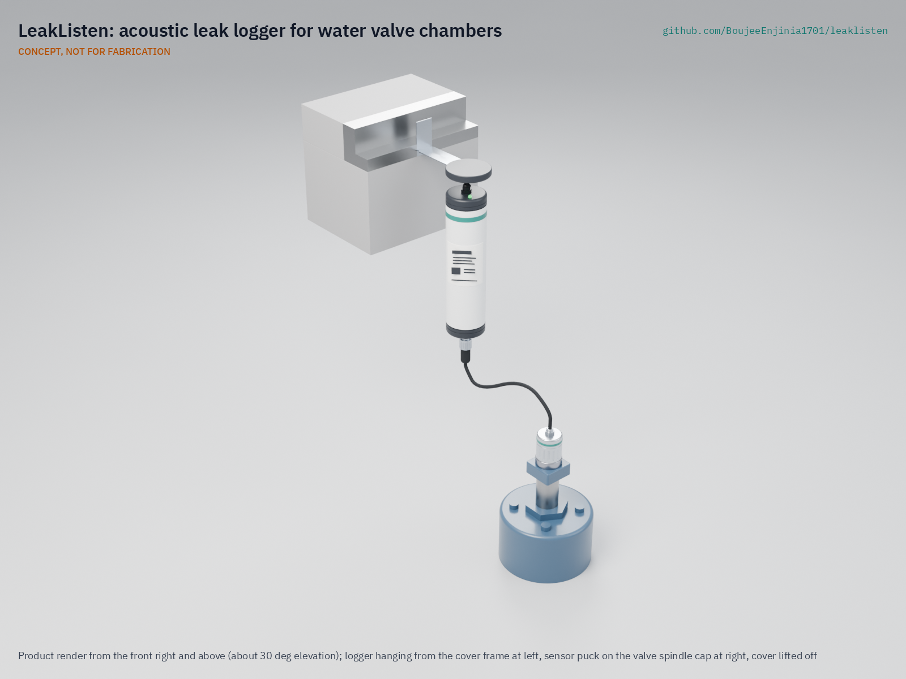

# LeakListen

  

**Area:** Smart Cities · **TRL:** 3 of 9 (proof of concept on paper) · **Prototype budget:** about $130 USD · **Difficulty:** 3 of 5

An acoustic leak sensor that clamps onto water mains and valves and listens overnight for the noise signature of leaks.

[Exploded render](media/render-exploded.png) · [Detail render](media/render-detail.png) · [Interactive 3D model](media/viewer.html) · [Concept blueprint (PDF)](media/concept-blueprint.pdf) · [General arrangement LKL-DWG-001 (PDF)](cad/drawings/LKL-DWG-001.pdf) · [Sizing calculations](docs/04-calcs/01-sizing.md) · [Review note](docs/REVIEW.md)

## Concept rationale

Leaks on pressurized mains make a steady hiss that travels along the pipe wall, and it is easiest to hear at night, when demand and traffic are low. A logger that listens to every valve in a district for a few minutes each night, and flags the ones whose quietest level has risen, turns a slow street-by-street survey into a short list of places to check. LeakListen does this with a magnet-on piezo sensor, a logger that hangs under the chamber cover, one primary cell for years of life and a single small LoRaWAN message a night.

It is open and garage-buildable because the utilities with the highest losses are often the least able to buy and maintain a fleet of closed commercial loggers. The parts are a turned aluminium puck, a piezo disc, a PVC tube, a standard LoRaWAN module and a lithium cell, for about $113 per logger, and the data format is documented so any network server, including the lab's TwinKit gateway, can read it.

## Burning platform

Water utilities lose an estimated 126 billion m³ of treated water a year to leaks and unbilled use, worth nearly $40 billion ([World Bank](https://blogs.worldbank.org/en/ppps/what-do-private-companies-look-performance-based-non-revenue-water-project)). In developing countries alone, about 45 million m³ a day leak from distribution networks, "enough to serve nearly 200 million people" ([Kingdom, Liemberger and Marin, World Bank, 2006](https://documents1.worldbank.org/curated/en/385761468330326484/pdf/394050Reducing1e0water0WSS81PUBLIC1.pdf)).

High-income networks are not immune. The United States still has about 240,000 water main breaks a year, costing about $2.6 billion in repairs ([ASCE 2025 Report Card](https://infrastructurereportcard.org/cat-item/drinking-water-infrastructure/)). Many leaks, though, never break the surface and run until someone listens for them.

## Where it could be used

### By industry

| Industry | Use |
| --- | --- |
| Municipal water utilities | Nightly screening of a district metered area, so leak crews go to flagged streets first |
| Small towns and community water schemes | A handful of loggers on the key valves of a small network without a specialist contract |
| Campuses, airports and industrial parks | Leaks on private mains after the utility meter, which the utility does not survey |
| Irrigation districts | Leaks on buried pressurized irrigation pipelines |
| Fire protection networks | Hidden leaks on private fire mains that stay pressurized but rarely flow |
| Research and education | An open logger and dataset for leak noise research and teaching |

### By country or region

| Country or region | Why it matters there |
| --- | --- |
| United States | About 240,000 water main breaks a year ([ASCE 2025](https://infrastructurereportcard.org/cat-item/drinking-water-infrastructure/)); many small utilities cannot fund commercial logger fleets. |
| England and Wales | Companies leaked an average of 2,967 million litres a day from April 2022 to March 2025, and all have leakage reduction targets ([Discover Water](https://www.discoverwater.co.uk/leaking-pipes)). |
| Southeast Asia | A study of 47 utilities in Indonesia, Malaysia, Thailand, the Philippines and Vietnam found non-revenue water averaging 30 %, ranging from 4 to 65 % ([Kingdom et al., 2006](https://documents1.worldbank.org/curated/en/385761468330326484/pdf/394050Reducing1e0water0WSS81PUBLIC1.pdf)). |
| Developing countries generally | About 45 million m³ a day lost to leakage ([Kingdom et al., 2006](https://documents1.worldbank.org/curated/en/385761468330326484/pdf/394050Reducing1e0water0WSS81PUBLIC1.pdf)); a low-cost open logger suits utilities starting a leak program. |
| South Africa | About 22 million people, 39 % of the population, were affected by intermittent water supply in 2017, and 65 of 231 municipalities supplied water intermittently ([Loubser, Chimbanga and Jacobs, 2021, *Water SA*](https://scielo.org.za/scielo.php?pid=S1816-79502021000100001&script=sci_arttext)). LeakListen only hears leaks on pressurized pipes, so it fits zones with continuous supply, and a pilot there would test that limit. |

## What sparked the idea

The starting point was the way Tokyo finds hidden leaks. Inspectors of the Tokyo Metropolitan Government Bureau of Waterworks press the tip of a listening rod against a water meter, gate valve or fire hydrant and listen for leak noise through a diaphragm, alongside night-time minimum flow measurements, electronic detectors, correlators and noise loggers; with this sustained effort the city's leakage rate fell from 10.2 % in fiscal 1992 to 3.5 % in fiscal 2024 ([Bureau of Waterworks, *Prevention of Leakage in Tokyo 2025*](https://www.english.metro.tokyo.lg.jp/documents/d/english/knowledge_and_tech_r07rousui)). Few utilities can staff that many trained listeners. LeakListen asks whether a cheap, open logger left on the same gate valves could do the first round of that listening every night, so the scarce experts go only where a valve has started to hiss.

## Problem

A large share of treated city water is lost to leaks before it reaches customers, and leaks are found by slow manual surveys. Full problem statement: [docs/01-problem.md](docs/01-problem.md).

## Concept

A magnetic piezo sensor clips onto a valve spindle cap and a sealed logger hangs under the chamber cover, placed from the surface with no chamber entry. Each night between 02:00 and 04:00 the logger records twelve 20 s windows, computes levels and a 64-band spectrum from 5 Hz to 2 kHz, deletes the raw samples and sends a 24-byte summary over LoRaWAN. A server (or the lab's TwinKit gateway) flags a logger whose night-time minimum level rises and stays up, and a crew then pinpoints the leak with standard tools.

Estimated performance at TRL 3 ([LKL-CAL-001](docs/04-calcs/01-sizing.md)): about 1.2 mAh a day and 10 years or more on one C-size lithium cell; 0.98 kg; $113.00 in parts. The reference leak (5 L/min at 3 bar) is heard about 185 m along an iron main, with a wide uncertainty. The magnet-on sensor is for metallic mains; plastic networks are served by a hydrophone variant on hydrants, not yet sized (R2). Under a cast-iron cover the radio reaches about 0.5 km, so a gateway is planned within 0.5 km of each such district (R7, at risk until cover loss is measured). Also at risk: detection on iron (R1), sensor bandwidth (R3) and noise (R4). A 42 mm magnet now holds 125 N on a coated cap (R9 met on paper). Install time and the false alarm rate need field work.

Full design precis: [docs/02-concept.md](docs/02-concept.md) · Requirements: [docs/03-requirements.md](docs/03-requirements.md) · Decisions: [DDR-001](docs/decisions/0001-trl2-review-decisions.md), [DDR-002](docs/decisions/0002-recommendations-accepted.md) · Model: [cad/src/model.py](cad/src/model.py)

## Key components

- Aluminium sensor puck with a 42 mm pot magnet (with keeper plate), a piezo disc under a 53 g brass mass and a charge preamplifier
- 2 m shielded sensor cable with an M12 IP68 plug
- IP68 PVC logger tube with an STM32WL LoRaWAN board (FieldNode core) and a 24-bit ADC
- Lithium thionyl chloride C cell, primary, about 7.7 Ah
- Stainless hanger that hooks over the cover frame, with a flat LoRa antenna just under the cover

The working bill of materials is in [bom/bom.csv](bom/bom.csv).

## Safety

> Valve chambers can be confined spaces with low oxygen or toxic gas; LeakListen is placed from the surface, and nobody should enter a chamber without a confined space permit, gas testing and a trained standby person. Covers are heavy and street work needs traffic management.
>
> The logger uses a lithium thionyl chloride primary cell: never charge it, short it, crush it or heat it, and follow the dangerous goods rules for lithium metal cells. The pot magnet can pinch fingers and affect pacemakers.
>
> Place loggers on a public water network only with the utility's written permission.

## Repository layout

| Folder | Contents |
| --- | --- |
| `docs/` | Problem, concept, requirements, calculations and design decisions |
| `cad/src/` | build123d Python source, the source of truth for all geometry |
| `cad/step/`, `cad/stl/` | Exported models for FreeCAD, other CAD tools and printing |
| `cad/drawings/` | 2D sketches and dimensioned drawings |
| `bom/` | Bill of materials |
| `electronics/` | KiCad schematics and PCB layouts |
| `firmware/` | Microcontroller code |
| `media/` | Renders, perspectives and photos |
| `build-log/` | Dated prototyping notes |

## Documentation

Controlled documents follow the portfolio [documentation standard](.kit/STANDARDS.md). Each carries a document ID (LKL-PRC-001 for the precis), a version and a revision history. Branded PDFs are built with `python .kit/render.py` and attached to GitHub Releases when a document is tagged, for example `LKL-PRC-001/v1.0`.

## Credits

Designed by Amish Chadha. See [CONTRIBUTORS.md](CONTRIBUTORS.md) for roles. To cite this design, use [CITATION.cff](CITATION.cff) (GitHub shows it as "Cite this repository").

AI assistance (Claude) was used to accelerate concept renders, prototype documentation and first-pass sizing calculations. Design direction and all decisions are Amish Chadha's, recorded in this repository's decision records (`docs/decisions/`).

## Licenses

- **Hardware** (CAD, drawings, BOM, electronics): [CERN-OHL-S v2](LICENSE)
- **Software** (firmware, scripts, notebooks): [MIT](LICENSE-SOFTWARE)

A project of the [Design Molecule](https://designmolecule.com) lab.
